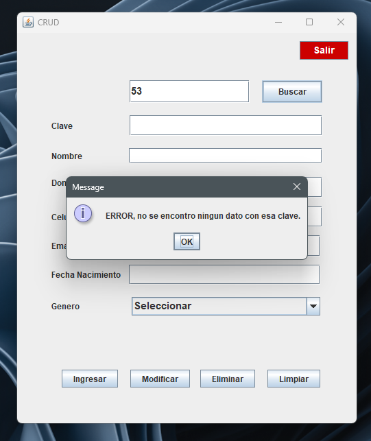

# CRUD
* Realizado con el lenguaje de programación Java implementando Java Swing
* Utilizando el gestor de base de datos MySQL.
* Siguiendo el patrón MVC (Modelo, Vista, Controlador)
* Realiza las 4 acciones básicas que realiza un CRUD:
    + create: ingresar datos
    + read: consultar datos
    + update: modificar datos
    + delete: eliminar datos
    
## Recursos
* Java version "1.8.0_371"
* Java(TM) SE Runtime Environment (build 1.8.0_371-b11)
* Mysql-connector-java-8.0.30.jar 

---

---

---

---

---

---
